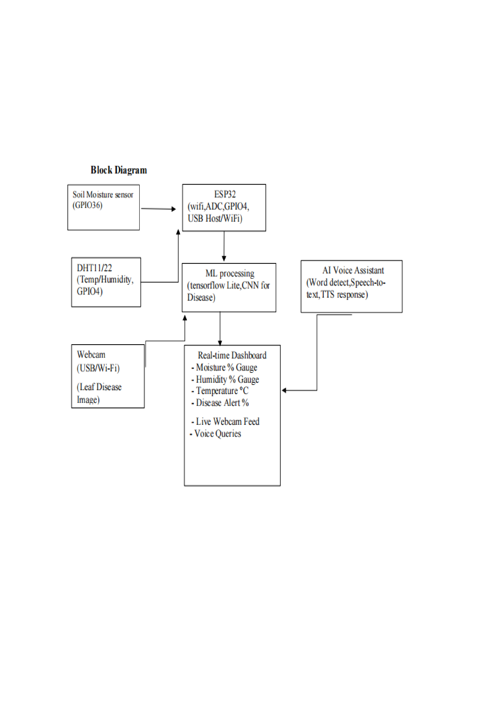

# 🤖 AI Powered Smart Multipurpose Agribot

An **AI + IoT based smart agriculture system** designed to monitor farm conditions in real time and assist farmers with intelligent crop management.

The system uses an **ESP32, soil moisture sensor, DHT11/DHT22 temperature and humidity sensor, camera-based leaf image analysis, AI/ML model, and IoT dashboard** to provide real-time agricultural monitoring and plant-health analysis.

---

## 🎯 Objectives

* Design a multipurpose agricultural system for soil monitoring, irrigation support and disease detection.
* Integrate AI/ML for plant disease detection using leaf images.
* Provide centralized monitoring through an IoT dashboard.
* Reduce manual effort and improve precision in agriculture.
* Develop a scalable and cost-effective solution for farmers.

---

## ⭐ Key Features

* 🌱 **Soil Moisture Monitoring**
* 🌡️ **Temperature Monitoring**
* 💧 **Humidity Monitoring**
* 🦠 **AI/ML-based Leaf Disease Detection**
* 📡 **ESP32 Wi-Fi Connectivity**
* 📊 **Real-Time IoT Dashboard**
* 💦 **Smart Irrigation Support**
* 🚨 **Environmental Alerts**

---

## 🏗️ System Architecture

```text
                    ┌──────────────────────┐
                    │  Soil Moisture       │
                    │      Sensor          │
                    └──────────┬───────────┘
                               │
                               ▼
                    ┌──────────────────────┐
                    │        ESP32         │
                    │ Wi-Fi + ADC + GPIO   │
                    └───────┬───────┬──────┘
                            │       │
              ┌─────────────┘       └──────────────┐
              ▼                                    ▼
     ┌─────────────────┐                  ┌─────────────────┐
     │    DHT11/22     │                  │ Camera / Leaf   │
     │ Temperature &   │                  │     Image       │
     │    Humidity      │                  └────────┬────────┘
     └─────────────────┘                           │
                                                   ▼
                                        ┌────────────────────┐
                                        │     AI/ML Model    │
                                        │ Leaf Disease        │
                                        │ Classification      │
                                        └─────────┬──────────┘
                                                  │
                                                  ▼
                                        ┌────────────────────┐
                                        │   IoT Dashboard    │
                                        │                    │
                                        │ • Moisture         │
                                        │ • Temperature      │
                                        │ • Humidity         │
                                        │ • Disease Status   │
                                        │ • Alerts           │
                                        └────────────────────┘
```

The project architecture uses the ESP32 as the central controller for sensor collection, Wi-Fi communication, ML processing interaction and dashboard updates.

---

## 🔧 Hardware Components

| Component                   | Purpose                                |
| --------------------------- | -------------------------------------- |
| **ESP32 Development Board** | Main controller and Wi-Fi connectivity |
| **Soil Moisture Sensor**    | Measures soil water content            |
| **DHT11 / DHT22**           | Measures temperature and humidity      |
| **Camera / ESP32-CAM**      | Captures plant leaf images             |
| **Breadboard**              | Circuit prototyping                    |
| **Jumper Wires**            | Component connections                  |
| **USB Cable**               | Programming and power                  |
| **Power Supply**            | Provides power to the system           |

The component list is documented in the project's Appendix A.

---

## 💻 Technologies Used

### Embedded Systems

* Embedded C
* ESP32
* Arduino IDE
* GPIO
* ADC
* Sensor interfacing

### AI / Machine Learning

* Python
* TensorFlow
* Keras
* OpenCV
* NumPy
* CNN-based image classification

### IoT

* Wi-Fi
* Firebase
* MQTT Cloud
* Blynk / ThingSpeak
* Real-time dashboard

The project report specifies Embedded C for ESP32 programming, Python for AI/ML model training and JavaScript/HTML for custom dashboard development.

---

## ⚙️ How It Works

### 1. Sensor Initialization

The ESP32 initializes:

* Wi-Fi
* DHT11/DHT22
* Soil moisture sensor

### 2. Environmental Monitoring

The ESP32 continuously reads:

```text
Temperature
Humidity
Soil Moisture
```

### 3. Soil Condition Analysis

The soil moisture reading is converted into a percentage.

The project pseudocode defines:

```text
If moisture < 30%
        ↓
    Soil Dry

If moisture ≥ 30%
        ↓
   Soil Normal
```

This threshold is specified in the project report's pseudocode.

### 4. Leaf Disease Detection

A camera captures plant leaf images.

The AI/ML model analyzes the images and performs leaf disease classification. The report describes CNN-based processing for this purpose.

### 5. IoT Communication

The ESP32 uses Wi-Fi to send sensor information to the IoT platform.

### 6. Dashboard Monitoring

The farmer can monitor:

* Soil moisture
* Temperature
* Humidity
* Disease status
* Alerts and recommendations

---

## 🧠 AI/ML Module

The AI/ML module is designed for **plant leaf image classification and disease detection**.

The project report identifies possible detection categories such as:

* Fungal diseases
* Bacterial spots
* Nutrient deficiency
* Pest infection
* Plant stress

The report describes CNN-based image analysis and mentions TensorFlow Lite/Edge Impulse as possible deployment approaches.

---

## 📊 IoT Dashboard

The real-time dashboard provides centralized monitoring of agricultural information.

Example:

```text
┌──────────────────────────────────┐
│       SMART FARM DASHBOARD       │
├──────────────────────────────────┤
│ Soil Moisture : 32 %             │
│ Temperature   : 25 °C            │
│ Humidity      : 60 %             │
│ Disease       : Normal           │
│ Alert         : None             │
└──────────────────────────────────┘
```

The project report documents dashboard testing with successful sensor data uploads and real-time updates.

---

## 🧪 Testing & Results

The system was tested at both **module level** and **system level**.

### Module Testing

* Power testing
* DHT11 sensor testing
* Soil moisture sensor testing
* ESP32 testing
* IoT dashboard testing

### System Testing

* ESP32 + DHT11
* ESP32 + Soil Moisture Sensor
* ESP32 + DHT11 + Soil Moisture Sensor
* ESP32 + IoT Cloud

The reported results include stable sensor readings, successful Wi-Fi communication, real-time dashboard visualization and successful AI-based leaf detection tests.

---

## 🌾 Applications

### Smart Irrigation

Uses soil moisture information to support irrigation decisions.

### Real-Time Crop Monitoring

Allows farmers to monitor soil and environmental conditions remotely.

### Plant Disease Detection

AI/ML analysis provides early indications of plant health problems.

### Farm Climate Monitoring

Temperature and humidity measurements help monitor crop-growing conditions.

---

## 🚀 Future Scope

* Upgrade DHT11 to DHT22/SHT-series sensors when higher accuracy is required.
* Add light/UV and rain sensors.
* Introduce LoRa or Wi-Fi range extenders for larger farms.
* Use solar panel and battery power for remote fields.
* Deploy lightweight AI models on-device.
* Retrain disease models using farmer-captured images.
* Add CSV export and offline data logging.
* Support multiple ESP32 nodes through a central gateway.
* Add simple dashboard configuration for farmers.

---

## 📁 Suggested Repository Structure

```text
AI-Smart-Multipurpose-Agribot/
│
├── README.md
│
├── hardware/
│   ├── circuit_diagram/
│   └── component_list.md
│
├── embedded/
│   └── esp32_code/
│
├── ai_ml/
│   ├── training/
│   ├── model/
│   └── prediction/
│
├── dashboard/
│
├── images/
│
└── docs/
    └── AI_Smart_Multipurpose_Agribot_Project_Report.pdf
```

**Only create/upload folders for files you actually have.**

---

## 📸 Project Images

You can later add:

### System Architecture

```text

```

### IoT Dashboard

```text

```

### Hardware Prototype

```text

```

---

## 👨‍💻 Team Members

* **Abhishek D** — 2JI22EC002
* **Amit K** — 2JI22EC013
* **Kavya K** — 2JI22EC053
* **Manisha A** — 2JI22EC062

**Project Guide:** Mr. Viraj J., Professor, Department of E&CE, Jain College of Engineering, Belagavi.

---

## 🎓 Academic Project

**Department:** Electronics and Communication Engineering
**Institution:** Jain College of Engineering, Belagavi
**University:** Visvesvaraya Technological University (VTU)
**Academic Year:** 2025–2026

---

## 📌 Skills Demonstrated

**Embedded Systems:** ESP32, Embedded C, GPIO, ADC, sensor interfacing

**IoT:** Wi-Fi, cloud communication, real-time monitoring

**AI/ML:** CNN, image classification, plant disease detection

**Programming:** C, Python, JavaScript/HTML

**Tools:** Arduino IDE, VS Code, TensorFlow, Keras, OpenCV

---

## 📜 License

This project was developed as an academic project. Add an open-source license if you intend to make the source code publicly reusable.
